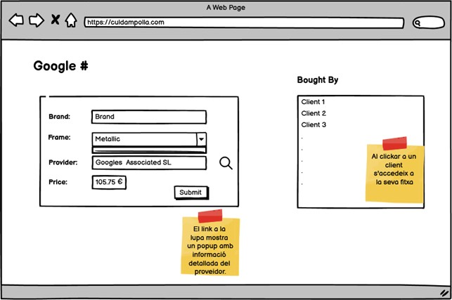

# MongoDB Data Structure

Development of MongoDB database structures for managing an optician.

##### Work from Sprint 5.3 of IT-Academy in the Node.js specialization.

### Level 1 - Optica

The project focuses on managing an optician. Here are the key points:

| **Collections** | **Attributes**                                                                                                           |
| --------------- | ----------------------------------------------------------------------------------------------------------------------- |
| Suppliers       | Name, address (street, number, floor, door, city, postal code, country), phone, fax, VAT number.                       |
| Glasses         | Brand, lens prescription, frame type (rimless, plastic, or metal), frame color, lens color, price. |
| Customers       | Name, postal address, phone, email, registration date, referring customer (if any).             |
| Sales           | Employee who made the sale, date and time of the sale.                                                                |

#### Modeling:

1. **Database design according to the optician's customer view.**

   - The exercise requires considering the necessary information to display the provided graphical interface.
    <details>
      <summary>🖥️ View</summary>
       <p align="center">
        
      </p>
   </details>

2. **Database design according to the glasses view.**
   - The exercise requires considering the necessary information to display the glasses interface.
      <details>
       <summary>🖥️ View</summary>
        <p align="center">
            
        </p>
     </details>


## Contribution

If you want to contribute to this project, follow these steps:

1. Fork the repository.
2. Create a new branch: `git checkout -b feature/your-feature-name`
3. Make your changes and commit: `git commit -am 'Add some feature'`
4. Push your changes to the branch: `git push origin feature/your-feature-name`
5. Submit a pull request.

## Support

If you encounter any issues or have any questions, please create a new issue on the [GitHub repository](https://github.com/Aredhel269/mongoDB-estructura/issues).

## License

This project is licensed under the MIT License.
```

